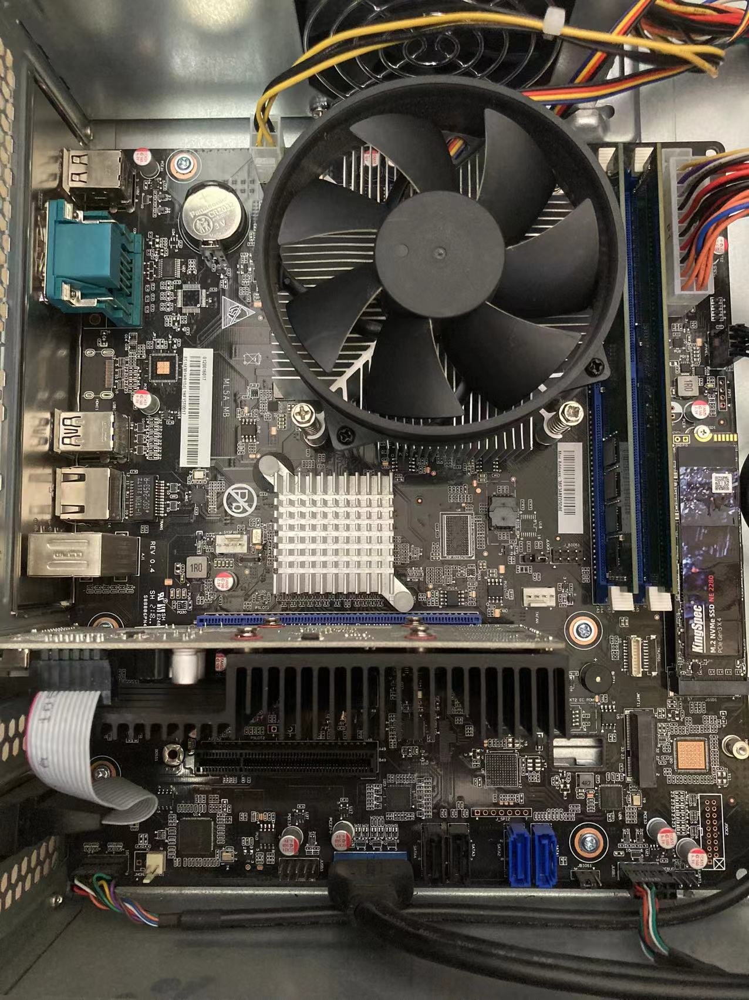
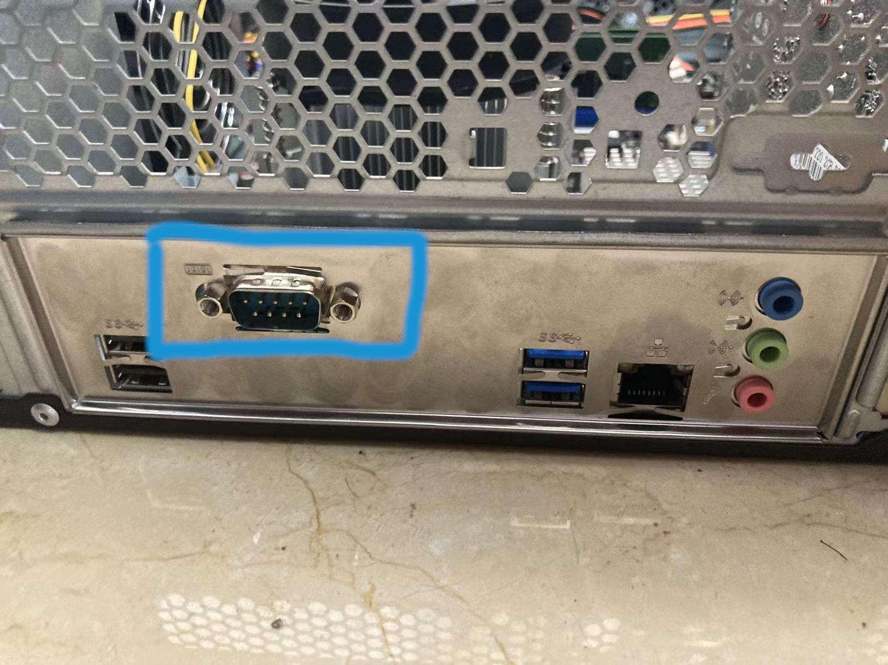
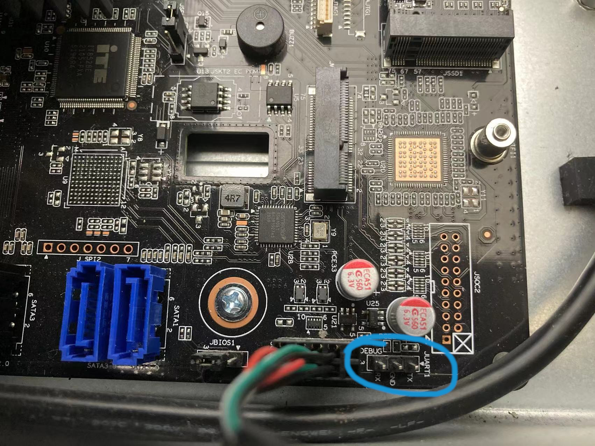
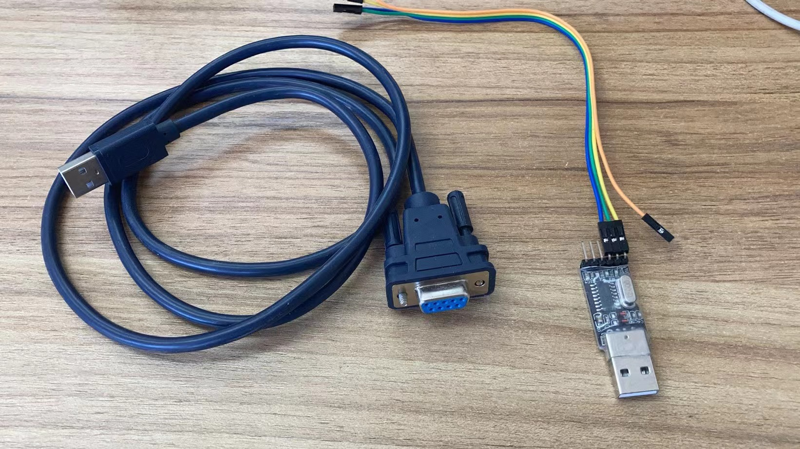

# 咸鱼购买的电脑抓取串口信息

## 所用环境

1. 系统： sunhaiyong clfs
2. 主板和调试设备

主板             |  db9公口 |  调试口串口 |  调试设备
:-------------------------:|:-------------------------:|:-------------------------:|:-------------------------:
  |   |  | 


## 流程

### 测试串口线

1. 安装串口线驱动，如果需要的话。
1. 短接端口
    * (TTL) 用一个杜邦线，将 ttl 的 TxD 和 RxD 短接。
    * (DB9) 百度找到 db9 母口的针脚定义图，我们发现， 2 TxD 3 RxD。用一根导线插入 2，3 进行短接。
2. 下载打开串口测试工具，我这里选择 putty。
2. 在 putty 中输入信息看 是否能输入信息，如果能输入信息，说明 ttl 设备正常。
3. 如果不能输入信息，调整 `Data bits` `Stop bits` `Parity` `Flow control` 参数，直到能够正常输入信息。
4. 如果还是不行，尝试换一个 串口测试工具，或者换一个设备。

我的配置：

|    |  ttl |  db9  |
| --- | --- | --- |
| Data bits | 8 | 8 |
| Stop Bits | 1 | 1 |
| Parity | None | None |
| Flow control | XON/XOFF | None |

### 接线方法

1. ttl

```
ttl RxD => 主板 TxD
ttl TxD => 主板 RxD
ttl GND => 主板 GND
```

2. db9

db9 母口接龙芯主板，usb 接另外一台电脑

### 用 ttl 获取主板调试信息

2. 打开 putty，设置 serial `/dev/ttyUSB0` speed `115200` 开始抓包，不同主板使用的频率可能不同，如果出现乱码可以优先调整这个参数。
3. 开机，抓取 日志信息。

### 测试 ttl/db9 对应 /dev/tty?

1. 接线，打开 putty
2. 进入 clfs 系统 执行 `ls /dev/ttyS*`， 显示的 tty设备挨个按照下面流程测试，以 `/dev/ttyS0` 为例
    1. `stty -F /dev/ttyS0 speed 115200` 设置串口频率为115200，这里设置的串口频率应该和 putty 中设置的相同。
    2. `echo "abc" > /dev/ttyS0` 如果 putty 中显示了 "abc" 则说明串口是 ttyS0，这个数据为下面 grub 中配置做准备。

### 用 ttl/db9 获取 grub 调试信息

1. 接线，打开 putty

grub 配置中添加 console 配置 `console=ttyS0,115200`  这里的 ttyS0 是上一步测试出来的结果

```
vim /boot/grub/grub.cfg 或在引导页面按 e 进行编辑手动引导

menuentry 'GNU/Linux System' {
    echo 'Loading kernel'
    linux /boot/vmlinux console=ttyS0,115200 loglevel=8 root=/dev/nvme0n1p2 rootdelay=5 rw
    initrd /boot/acpi-initrd
    boot
}
```

### 参考资料

1.  [通过串口获取开机引导信息](https://bbs.loongarch.org/d/40-3a5000clfs)